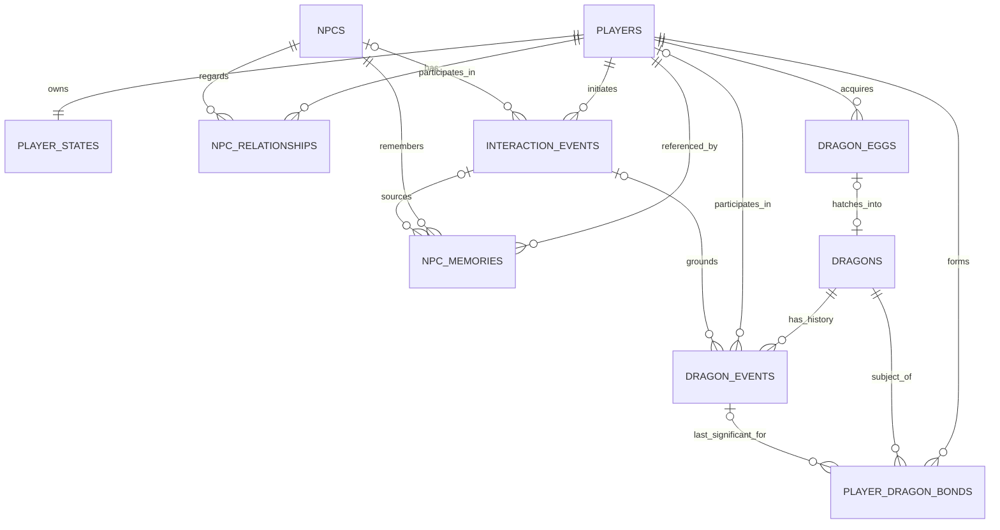

# PostgreSQL Database Schema Design v0.1

## 1. Document Status

- **阶段**：Step 6.7-A Finalization
- **性质**：PostgreSQL Database Schema Design v0.1 设计固化
- **状态**：FROZEN BASELINE
- **Freeze Date**：2026-09-02
- **实现状态**：Design only；尚未创建数据库、DDL、ORM Model 或 Migration
- **依据**：Frozen World / NPC / Memory / Relationship Contract、当前 JSON Runtime Store、Dragon Domain Design v0.1，以及 A1/A2/A3 已确认决策
- **Runtime Table 上限**：11 张

本文使用 PostgreSQL 类型和约束术语表达设计，但不包含 `CREATE TABLE` SQL。Domain Entity 不要求与 Table 进行 1:1 映射。

## 2. Design Goals

1. 将可变化的 Runtime Data 迁移到 PostgreSQL，并让数据库成为唯一 Runtime Source of Truth。
2. 保留现有 Stable Domain ID，v0.1 全部主键使用 `TEXT`，不迁移 UUID 主键。
3. 用 PK、FK、UNIQUE、CHECK 和 Transaction 固化已经确认的领域边界。
4. 保留 Player Claim、Memory Epistemic Status、Relationship Grounding、Dragon Bond 与 Event History 的既有安全原则。
5. 避免同一事实在多张表或 JSON + PostgreSQL 中长期双写。
6. 对尚未确认的数值范围和状态集合明确 Deferred，不猜测业务规则。
7. 让 JSON Runtime Store 可以作为一次性 Migration Source / Backup，但不继续参与运行时写入。

## 3. Configuration vs Runtime Data Boundary

### 3.1 Configuration Source of Truth：JSON + Git

以下内容保持配置数据，不进入本轮 11 张 Runtime Table：

- World Seed 的世界名称、Region、World Rules；
- Location Directory、连接关系与静态描述；
- NPC Profile、Personality、Goals、Stable Knowledge；
- Dragon Archetype、Habitat、Ability、基础 Temperament、Rideable 与 Species Milestone 配置。

Runtime Table 中引用 `location_id`、`npc_id` 或 `archetype_id` 时，应用层必须先对 Git Configuration Registry 做 Resolve 和 Validation。因为 v0.1 不把这些配置全部复制到 PostgreSQL，`location_id` 和 `archetype_id` 暂时不能建立数据库 FK。

### 3.2 Runtime Source of Truth：PostgreSQL

迁移完成后，下列数据只允许由 PostgreSQL 持有和更新：

- Player Identity 与 Player State；
- NPC Runtime State；
- NPC Memory 与 NPC Relationship；
- Individual Dragon 与其当前 Runtime State；
- PlayerDragonBond、Dragon Egg、Dragon Event；
- Interaction Event；
- World Runtime State。

### 3.3 No Long-term Dual Write

迁移验收前允许离线导入和对照读取；迁移验收后：

- PostgreSQL 是 Runtime 唯一可写 Source of Truth；
- `current_world.json`、`npc_memories.json`、`npc_relationships.json` 只作为 Migration Source / Backup；
- Runtime 必须停止写入旧 JSON Store；
- 不允许通过“同时写 PostgreSQL 与 JSON”维持长期兼容。

## 4. Stable ID Strategy

- 所有 PK 使用 `TEXT`，保留现有 Domain ID，不因显示名变化而改变。
- 示例包括 `npc_astrid`、`dragon_stormwing_001`。
- 当前仓库实际 Player ID 是 `player_001`，因此迁移必须保留 `player_001`。`player_eirik` 只是目标命名示例，不能根据角色名自动重命名已有 ID；若产品以后要求改名，必须使用显式 ID Migration Map。
- 当前 `npc_event_<hex>`、`npc_memory_<hex>` 等 ID 作为 TEXT 原样迁移，不在 v0.1 转为原生 UUID。

## 5. Table Catalog

| # | Table | 职责 | Source Category |
| --- | --- | --- | --- |
| 1 | `players` | Player 稳定身份 | Runtime |
| 2 | `player_states` | Player 当前 Location、Inventory、Goals | Runtime Current State |
| 3 | `npcs` | NPC Entity Registry 与当前动态状态 | Runtime Current State |
| 4 | `npc_memories` | NPC 主观持久记忆 | Runtime History/Subjective State |
| 5 | `npc_relationships` | NPC × Player 当前关系 | Runtime Current State |
| 6 | `dragons` | Individual Dragon 身份与当前状态 | Runtime Current State |
| 7 | `player_dragon_bonds` | Player × Dragon Bond | Runtime Current State |
| 8 | `dragon_eggs` | Egg Acquisition、Incubation 与 Hatching Link | Runtime Current State |
| 9 | `dragon_events` | Grounded Dragon Significant Event | Append-only History |
| 10 | `interaction_events` | 玩家互动事件，包括 Frozen NPC Dialogue Event | Append-only History |
| 11 | `world_state_entries` | World / Global 当前 Runtime 值 | Runtime Current State |

明确不增加 `dragon_runtime_states`：A3 决定将 Dragon 当前状态合并进 `dragons`。也不增加 `dragon_interaction_records`：v0.1 先由 `interaction_events` 与 `dragon_events` 承担来源、Audit 和幂等依据，是否需要独立表留作 Future Schema Question。

## 6. Table Definitions

以下 `Nullable = 否` 等价于数据库 `NOT NULL`；`Default = —` 表示数据库不提供默认值，Runtime 创建记录时必须显式提交。

### 6.1 `players`

Player 稳定身份数据。可变化的 Location、Inventory 与 Goals 不放在此表。

| Column | PostgreSQL Type | Nullable | Default | Key / Constraint | Frozen Mapping |
| --- | --- | --- | --- | --- | --- |
| `player_id` | `TEXT` | 否 | — | PK | `player.id` |
| `name` | `TEXT` | 是 | — | — | Player Creation 允许未命名模板 |
| `species` | `TEXT` | 是 | — | CHECK：`human / dragon` | Frozen Player Schema |
| `occupation` | `TEXT` | 是 | — | — | 自由字符串，不建立职业 Enum |
| `background` | `TEXT` | 是 | — | — | Grounded Player Background |
| `traits` | `JSONB` | 否 | — | CHECK：JSON Array，最多 5 项且由应用保证唯一字符串 | Frozen Player Schema |

`name/species` 可空是为了兼容 New Game 的空白 Player Template。正式 Player Commit 后，应用层仍应要求符合 Frozen Player Creation Contract。

### 6.2 `player_states`

Player 当前可变状态；与 `players` 一对一。

| Column | PostgreSQL Type | Nullable | Default | Key / Constraint | Frozen Mapping |
| --- | --- | --- | --- | --- | --- |
| `player_id` | `TEXT` | 否 | — | PK；FK → `players.player_id`，ON DELETE CASCADE | Player State Owner |
| `current_location` | `TEXT` | 否 | — | Application FK-like validation → Location Config | `player.current_location` |
| `inventory` | `JSONB` | 否 | — | CHECK：JSON Array | 现有 Inventory；v0.1 不拆 Items Table |
| `goals` | `JSONB` | 否 | — | CHECK：JSON Array，最多 5 项且由应用保证唯一字符串 | Frozen Player Goals |

`players.current_location` 明确不存在。Location Config 不在数据库，因此由 Runtime 对 Git Configuration Registry 校验。

### 6.3 `npcs`

只保存 NPC Entity Registry 与动态状态。Name、Species、Occupation、Profile、Personality 和 Knowledge 继续由 Anchor NPC Profile JSON + Git 持有。

| Column | PostgreSQL Type | Nullable | Default | Key / Constraint | Frozen Mapping |
| --- | --- | --- | --- | --- | --- |
| `npc_id` | `TEXT` | 否 | — | PK；必须 Resolve 到 NPC Profile Config | `npc.id` |
| `current_location` | `TEXT` | 否 | — | Application validation → Location Config | World State NPC location |
| `current_activity` | `TEXT` | 是 | — | — | NPC Runtime State 可选字段 |
| `current_goal` | `TEXT` | 是 | — | — | 当前 World State 动态目标 |
| `mood` | `TEXT` | 是 | — | — | 当前 Mood；未建立新 Enum |

当前 `world_seed.json/current_world.json` 中重复出现的 NPC Name、Species、Occupation、Personality 和 Knowledge 不导入此表；这些字段由 `anchor_npcs.json` Profile/Knowledge 作为 Configuration Source of Truth。

### 6.4 `npc_memories`

保存 Frozen Persistent NPC Memory。Memory 是 NPC 主观记录，不是 World Truth。

| Column | PostgreSQL Type | Nullable | Default | Key / Constraint | Frozen Mapping |
| --- | --- | --- | --- | --- | --- |
| `memory_id` | `TEXT` | 否 | — | PK | `memory_id` |
| `npc_id` | `TEXT` | 否 | — | FK → `npcs.npc_id`，ON DELETE RESTRICT | `npc_id` |
| `player_id` | `TEXT` | 否 | — | FK → `players.player_id`，ON DELETE RESTRICT | `player_id` |
| `source_event_id` | `TEXT` | 是 | — | FK → `interaction_events.event_id`，ON DELETE RESTRICT；UNIQUE with `npc_id` when non-null | `source_event_id` |
| `memory_type` | `TEXT` | 否 | — | CHECK：`player_intention / player_claim / interaction` | Frozen Memory Enum |
| `content` | `TEXT` | 否 | — | CHECK：非空 | Frozen Memory Content |
| `epistemic_status` | `TEXT` | 否 | — | CHECK：`reported_by_player / observed_interaction` | Frozen Truth Boundary |
| `world_day` | `INTEGER` | 否 | — | CHECK：`>= 1` | `world_context.world_day` |
| `world_hour` | `SMALLINT` | 否 | — | CHECK：`0..23` | `world_context.world_hour` |
| `location_id` | `TEXT` | 否 | — | Application validation → Location Config | `world_context.location_id` |
| `created_from_topic` | `TEXT` | 否 | — | CHECK：长度 `1..80` | Frozen Topic |
| `metadata` | `JSONB` | 是 | — | Flexible migration/audit metadata；不得覆盖核心字段 | Legacy provenance only |

Idempotency 使用 `UNIQUE(npc_id, source_event_id)`；PostgreSQL 对 NULL 不冲突，因此缺少 Event 的 Legacy Memory 仍可导入。

Frozen JSON Memory 要求 `source_event_id` 非空，但历史 Interaction Event 当时没有持久化 Event Log。迁移时：有完整 Event 的记录建立 FK；没有完整 Event 的记录令 `source_event_id=NULL`，原 ID 保存到 `metadata.legacy_source_event_id`。这是 Migration Mapping，不改变新 Runtime Memory Contract；新写入仍必须携带合法 Event FK。

### 6.5 `npc_relationships`

保存 Frozen NPC × Player 当前关系以及 JSON v0.1 的轻量幂等 Audit。

| Column | PostgreSQL Type | Nullable | Default | Key / Constraint | Frozen Mapping |
| --- | --- | --- | --- | --- | --- |
| `player_id` | `TEXT` | 否 | — | Composite PK；FK → `players.player_id`，ON DELETE RESTRICT | `player_id` |
| `npc_id` | `TEXT` | 否 | — | Composite PK；FK → `npcs.npc_id`，ON DELETE RESTRICT | `npc_id` |
| `familiarity` | `SMALLINT` | 否 | — | CHECK：`0..3` | Frozen NPC Relationship |
| `trust` | `SMALLINT` | 否 | — | CHECK：`-2..2` | Frozen NPC Relationship |
| `attitude` | `TEXT` | 否 | — | CHECK：`hostile / wary / neutral / warm` | Frozen NPC Relationship |
| `applied_event_ids` | `JSONB` | 否 | — | CHECK：非空、唯一字符串数组由应用保证 | Frozen Store Audit |
| `last_source_event_id` | `TEXT` | 否 | — | 不建 FK，见下文 | Frozen Store Audit |

现有 Relationship Store 保存 Event ID，但历史 Interaction Event 没有完整持久化记录，因此 `applied_event_ids` 与 `last_source_event_id` 在 v0.1 不能强制 FK。下一阶段可评估 Relationship Mutation Audit Table；本轮受 11 表上限约束，不新增表，也不丢弃现有幂等数据。

### 6.6 `dragons`

合并 Individual Dragon 身份与当前 Runtime State。Dragon Archetype 继续是 JSON + Git Configuration，不创建 `dragon_archetypes` 表。

| Column | PostgreSQL Type | Nullable | Default | Key / Constraint | Domain Mapping |
| --- | --- | --- | --- | --- | --- |
| `dragon_id` | `TEXT` | 否 | — | PK | Stable Individual Dragon ID |
| `archetype_id` | `TEXT` | 否 | — | Application validation → Dragon Archetype Config | Individual Archetype |
| `name` | `TEXT` | 是 | — | — | 可为空，不能作为身份键 |
| `sex` | `TEXT` | 是 | — | Deferred Enum | Individual Identity |
| `age_stage` | `TEXT` | 否 | — | CHECK：`hatchling / juvenile / young_adult / adult` | Frozen Dragon Domain |
| `appearance` | `JSONB` | 否 | — | Flexible descriptive data | Individual Appearance |
| `temperament_traits` | `JSONB` | 否 | — | CHECK：JSON Array | Individual Temperament |
| `current_location` | `TEXT` | 否 | — | Application validation → Location Config | Dragon Runtime Location |
| `health_state` | `TEXT` | 否 | — | Deferred Domain Constraint | Dragon Health |
| `energy` | `NUMERIC` | 否 | — | Range Deferred | Dragon Runtime State |
| `hunger` | `NUMERIC` | 否 | — | Range Deferred | Dragon Runtime State |
| `alertness` | `NUMERIC` | 否 | — | Range Deferred | Dragon Runtime State |
| `behavior_state` | `TEXT` | 否 | — | CHECK：见 v0.1 集合 | Dragon Runtime Behavior |
| `taming_state` | `TEXT` | 否 | — | CHECK：`wild / tolerant / bonding / tamed` | A3 Single-player Decision |

`behavior_state` CHECK 集合：`resting / feeding / wandering / watching / avoiding / threatening / attacking / following / flying`。

本表明确不保存 `origin_egg_id`；Egg → Dragon Origin 只由 `dragon_eggs.hatched_dragon_id` 表达。也不保存 `riding_unlocked`，该字段只属于 PlayerDragonBond。

A3 要求单玩家 v0.1 将 `taming_state` 放入 `dragons`，而 Frozen Dragon Domain 将其视为 Player-specific Bond 事实。数据库 v0.1 遵循 A3，但把 Multi-player Taming Ownership 标记为 Future Schema Question，不反向修改 Dragon Domain 文档。

### 6.7 `player_dragon_bonds`

保存 Player × Dragon 的 Familiarity、Trust、Fear、Bond 与 Riding Authorization。

| Column | PostgreSQL Type | Nullable | Default | Key / Constraint | Domain Mapping |
| --- | --- | --- | --- | --- | --- |
| `player_id` | `TEXT` | 否 | — | Composite PK；FK → `players.player_id`，ON DELETE RESTRICT | Bond Owner |
| `dragon_id` | `TEXT` | 否 | — | Composite PK；FK → `dragons.dragon_id`，ON DELETE RESTRICT | Bond Subject |
| `familiarity` | `SMALLINT` | 否 | — | CHECK：`0..5` | Frozen Dragon Range |
| `trust` | `SMALLINT` | 否 | — | CHECK：`-3..5` | Frozen Dragon Range |
| `fear` | `SMALLINT` | 否 | — | CHECK：`0..5` | Frozen Dragon Range |
| `bond` | `SMALLINT` | 否 | — | CHECK：`0..5` | Frozen Dragon Range |
| `riding_unlocked` | `BOOLEAN` | 否 | `false` | — | Frozen Riding Flag |
| `last_significant_event_id` | `TEXT` | 是 | — | FK → `dragon_events.event_id`，ON DELETE RESTRICT | Bond Audit |

除 `riding_unlocked=false` 外，不为 Familiarity、Trust、Fear 或 Bond 设置业务 Default。创建 Bond 时 Runtime 必须显式提供所有数值。

### 6.8 `dragon_eggs`

保存玩家已获得 Egg 的 Incubation 与 Hatching Link。

| Column | PostgreSQL Type | Nullable | Default | Key / Constraint | Domain Mapping |
| --- | --- | --- | --- | --- | --- |
| `egg_id` | `TEXT` | 否 | — | PK | Stable Egg ID |
| `archetype_id` | `TEXT` | 是 | — | Application validation → Archetype Config | NULL 表示尚未识别 |
| `acquired_by_player_id` | `TEXT` | 否 | — | FK → `players.player_id`，ON DELETE RESTRICT | Egg Owner |
| `incubation_state` | `TEXT` | 否 | — | Enum Deferred；`hatched` 已确认存在 | Egg Runtime State |
| `incubation_progress` | `NUMERIC` | 否 | — | Range Deferred | Egg Runtime State |
| `acquired_event_type` | `TEXT` | 否 | — | Polymorphic Reference discriminator | Grounded Acquisition |
| `acquired_event_id` | `TEXT` | 否 | — | Polymorphic Reference；无 FK | Grounded Acquisition |
| `hatched_dragon_id` | `TEXT` | 是 | — | FK → `dragons.dragon_id`，ON DELETE RESTRICT；UNIQUE | Hatching Result |
| `hatched_at` | `TIMESTAMPTZ` | 是 | — | 与 `hatched_dragon_id` 同时为空或非空 | Hatching Time |

`archetype_id=NULL` 表示 Unknown Egg；避免同时支持 NULL 与字面值 `unknown` 两种未知表示。若产品坚持使用 `unknown` Stable ID，下一阶段必须二选一并提供 Migration Rule。

立即可用的一致性 CHECK：`hatched_dragon_id` 与 `hatched_at` 必须同时为空或同时非空；`hatched_dragon_id` 非空时 `incubation_state` 必须为 `hatched`。

### 6.9 `dragon_events`

保存已经被 Runtime 验证的 Dragon Significant Event。采用 Append-only Policy。

| Column | PostgreSQL Type | Nullable | Default | Key / Constraint | Domain Mapping |
| --- | --- | --- | --- | --- | --- |
| `event_id` | `TEXT` | 否 | — | PK | Stable Dragon Event ID |
| `event_type` | `TEXT` | 否 | — | CHECK：Frozen Significant Event Set | Dragon Event Type |
| `dragon_id` | `TEXT` | 否 | — | FK → `dragons.dragon_id`，ON DELETE RESTRICT | Event Subject |
| `player_id` | `TEXT` | 是 | — | FK → `players.player_id`，ON DELETE RESTRICT | 可空，支持非 Player Event |
| `source_interaction_event_id` | `TEXT` | 是 | — | FK → `interaction_events.event_id`，ON DELETE RESTRICT | Grounded Source |
| `world_day` | `INTEGER` | 否 | — | CHECK：`>=1` | World Time |
| `world_hour` | `SMALLINT` | 否 | — | CHECK：`0..23` | World Time |
| `location_id` | `TEXT` | 否 | — | Application validation → Location Config | Event Location |
| `milestone_key` | `TEXT` | 是 | — | Archetype Config validation | Species Milestone Evidence |
| `event_payload` | `JSONB` | 否 | — | Flexible grounded detail；不得保存核心当前状态副本 | Event Detail |
| `recorded_at` | `TIMESTAMPTZ` | 否 | `CURRENT_TIMESTAMP` | Technical audit default | Database Record Time |

Frozen `event_type` CHECK：

- `dragon_first_encounter`
- `dragon_accepts_food`
- `dragon_allows_close_presence`
- `dragon_allows_touch`
- `player_heals_dragon`
- `player_rescues_dragon`
- `dragon_rescues_player`
- `shared_danger_survived`
- `dragon_tamed`
- `dragon_accepts_mount`
- `first_shared_flight`

当 `source_interaction_event_id` 非空时，建议 `UNIQUE(dragon_id, source_interaction_event_id, event_type)`，阻止同一 Interaction 对同一 Dragon 重复创建同类 Grounded Event。

### 6.10 `interaction_events`

统一保存玩家互动历史。Frozen NPC Dialogue Event 是第一种 Event；`npc_id` 可空，为未来非 NPC Interaction 预留。

| Column | PostgreSQL Type | Nullable | Default | Key / Constraint | Frozen Mapping |
| --- | --- | --- | --- | --- | --- |
| `event_id` | `TEXT` | 否 | — | PK | `event_id` |
| `event_type` | `TEXT` | 否 | — | v0.1 不封闭为单一 Enum | `npc_dialogue` 或未来 Interaction Type |
| `player_id` | `TEXT` | 否 | — | FK → `players.player_id`，ON DELETE RESTRICT | `player_id` |
| `npc_id` | `TEXT` | 是 | — | FK → `npcs.npc_id`，ON DELETE RESTRICT | NPC Event 时必填 |
| `world_day` | `INTEGER` | 否 | — | CHECK：`>=1` | `world_context.world_day` |
| `world_hour` | `SMALLINT` | 否 | — | CHECK：`0..23` | `world_context.world_hour` |
| `location_id` | `TEXT` | 否 | — | Application validation → Location Config | `world_context.location_id` |
| `player_utterance` | `TEXT` | 否 | — | CHECK：非空 | Untrusted Player Expression |
| `npc_response` | `JSONB` | 是 | — | NPC Event 时为 `{response_type, speech}` | Frozen NPC Response projection |
| `topic` | `TEXT` | 是 | — | 非空时长度 `1..80` | Frozen Topic |
| `player_claims` | `JSONB` | 否 | — | CHECK：JSON Array；应用保证非空字符串唯一 | Frozen Claim/Intention Boundary |
| `memory_candidate` | `BOOLEAN` | 是 | — | NPC Event 时必填 | Frozen Candidate Signal |
| `relationship_signal` | `TEXT` | 是 | — | CHECK：NULL 或 `none / potential_positive / potential_negative` | Frozen Relationship Signal |
| `event_payload` | `JSONB` | 是 | — | 非 NPC Interaction 的扩展字段 | Flexible Event Detail |
| `recorded_at` | `TIMESTAMPTZ` | 否 | `CURRENT_TIMESTAMP` | Technical audit default | Database Record Time |

对 `event_type='npc_dialogue'` 的条件约束：`npc_id`、`npc_response`、`topic`、`memory_candidate`、`relationship_signal` 必须非空，且 `npc_response.response_type` 继续由 Frozen Schema/Application Validation 限定。非 NPC Interaction 不伪造 NPC 字段。

### 6.11 `world_state_entries`

保存 World / Global 当前 Runtime Truth。它不是 Event History；同一 `state_id` 可在验证后 UPDATE。

| Column | PostgreSQL Type | Nullable | Default | Key / Constraint | Runtime Mapping |
| --- | --- | --- | --- | --- | --- |
| `state_id` | `TEXT` | 否 | — | PK | 例如 `world.day`、`global.village_safety` |
| `state_value` | `JSONB` | 否 | — | Value type 由 State Registry/Application 校验 | 当前 World State Value |
| `source_event_type` | `TEXT` | 是 | — | Polymorphic Reference discriminator；无 FK | Last Grounded Source |
| `source_event_id` | `TEXT` | 是 | — | Polymorphic Reference；无 FK | Last Grounded Source |
| `updated_at` | `TIMESTAMPTZ` | 否 | `CURRENT_TIMESTAMP` | Technical timestamp | Current State Audit |

CHECK：`source_event_type` 与 `source_event_id` 必须同时为空或同时非空。World Name、Region、Rules、Locations 等静态配置不写入本表。

## 7. Entity Relationships



外部 Configuration Registry 关系：

```text
NPCS.npc_id ----------------------> NPC Profile JSON (application validation)
DRAGONS.archetype_id -------------> Dragon Archetype JSON (application validation)
DRAGON_EGGS.archetype_id ---------> Dragon Archetype JSON (nullable)
*.current_location / location_id -> Location Directory JSON (application validation)
```

`world_state_entries.source_event_*` 与 `dragon_eggs.acquired_event_*` 是 Polymorphic Reference，不在 v0.1 ERD 中伪造 FK。

## 8. Delete Policies

v0.1 不把 Hard Delete 作为正常游戏功能。

| Parent → Child / Reference | Policy | 原因 |
| --- | --- | --- |
| `players → player_states` | ON DELETE CASCADE | Player State 完全依赖 Player |
| Player/NPC → Memory | ON DELETE RESTRICT | 防止丢失主观历史 |
| Player/NPC → Relationship | ON DELETE RESTRICT | 防止无意删除累积关系 |
| Player/Dragon → Bond | ON DELETE RESTRICT | Bond 是重要 Persistent State |
| Player → Egg | ON DELETE RESTRICT | Egg Acquisition 历史不可静默丢失 |
| Dragon → Egg Link | ON DELETE RESTRICT | 保持孵化来源一致性 |
| Player/Dragon/Interaction → Dragon Event | ON DELETE RESTRICT | Event 是历史证据 |
| Player/NPC → Interaction Event | ON DELETE RESTRICT | Interaction Event 是历史 |
| Dragon Event → Bond last event | ON DELETE RESTRICT | 保持 Bond Audit 可追溯 |

Soft Delete 是 Future Enhancement；本轮不增加 `deleted_at`、Status 或完整 Retention Policy。

## 9. Event and State Model

### 9.1 Event = History

`interaction_events` 与 `dragon_events` 采用 Append-only 思想：

- 正常 Runtime 只 INSERT 新 Event；
- 不 UPDATE 已发生 Event；
- 不 DELETE 历史 Event；
- 更正策略未来应采用补偿 Event，而不是覆写历史。

### 9.2 State = Current Truth

`player_states`、`npcs`、`dragons`、`npc_relationships`、`player_dragon_bonds`、`dragon_eggs` 和 `world_state_entries` 表示当前状态，可在 Grounded Validation 后 UPDATE。

Memory 是带 Epistemic Status 的主观 Persistent Record；它不是 Objective World State，但作为历史记录正常不原地改写内容。

### 9.3 Polymorphic References

`world_state_entries(source_event_type, source_event_id)` 和 `dragon_eggs(acquired_event_type, acquired_event_id)` 可引用 Interaction Event、Dragon Event 或未来 System Event。v0.1 不建立 FK，因为目标表由 discriminator 决定。Runtime Commit 必须验证目标 Event 存在且类型匹配。

未来若引入统一 Event Supertype，可以把这些字段迁移为真正 FK；本轮不增加第 12 张 Event Registry Table。

## 10. JSONB Policy

### 10.1 适合 JSONB

- Player Traits、Inventory、Goals；
- Dragon Appearance、Temperament Traits；
- Event Payload；
- NPC Response projection、Player Claims；
- World State Value；
- Migration/Audit Metadata；
- 现有 Relationship `applied_event_ids`（v0.1 表数限制下的兼容方案）。

### 10.2 必须是普通 Column

- `current_location`
- `taming_state`
- `behavior_state`
- Familiarity、Trust、Fear、Bond
- `riding_unlocked`
- Event ID、Entity ID、Event Type
- `memory_type`、`epistemic_status`
- Egg Incubation State 与 Hatched Dragon Link

原则：Frequently queried / constrained → Column；Flexible descriptive data → JSONB。JSONB 不得成为绕过 CHECK、FK、Grounded Evidence 或 Mutation Allowlist 的入口。

## 11. Transaction Boundaries

### 11.1 Dragon Egg Hatching Transaction

成功 Hatching 必须在一个 PostgreSQL Transaction 中完成：

1. 创建 Individual Dragon；
2. 初始化 `dragons` 当前状态，设置 `age_stage=hatchling`、`taming_state=bonding`；
3. 更新 Egg：`incubation_state=hatched`、`hatched_dragon_id=<new dragon>`、`hatched_at=<time>`；
4. 创建 PlayerDragonBond：`familiarity=5`、`trust=2`、`fear=0`、`bond=1`、`riding_unlocked=false`；
5. 写入对应 Grounded Dragon Event。

任一步失败必须全部 Rollback。`dragons.origin_egg_id` 不存在，因此不存在反向双写。

### 11.2 Interaction-derived Persistence

新的 Interaction Event 必须先 Append，再由服务端重新验证候选 Mutation。Memory、Relationship、Dragon Event 或 State 更新必须引用已经写入的 Event，并在各自事务中执行 Idempotency Check。

是否把 Interaction Event 与所有下游 Mutation 放入同一跨领域事务，留到 Runtime / Unit of Work Design；本轮不声明自动全局事务。

### 11.3 Current State Mutation

World、Player、NPC、Dragon 与 Bond 状态更新必须在事务内读取当前值、验证前置条件并写入新值。客户端和 LLM 不能直接提交最终数值。

## 12. Frozen Contract Mapping

| Frozen JSON / Domain Field | PostgreSQL Mapping | Notes |
| --- | --- | --- |
| `player.id` | `players.player_id` | 当前实际值 `player_001` 原样保留 |
| Player identity fields | `players.*` | Name/Species/Occupation/Background/Traits |
| `player.current_location` | `player_states.current_location` | 唯一 Player Location Source |
| `player.inventory/goals` | `player_states.inventory/goals` | JSONB，不拆表 |
| NPC Profile/Knowledge | JSON + Git | 不复制进 Runtime DB |
| NPC current fields | `npcs.*` | 只迁动态字段 |
| Memory `world_context` | `npc_memories.world_day/world_hour/location_id` | 结构扁平化，不改变语义 |
| Memory Enum/Status | `npc_memories` CHECK | 完全照搬 Frozen Contract |
| Relationship State | `npc_relationships` | 范围和 Attitude 完全照搬 |
| Relationship Audit arrays | `npc_relationships.applied_event_ids` | JSONB 兼容；未来可规范化 |
| NPC Interaction Event | `interaction_events` | World Context 扁平；Response/Claims JSONB |
| Dragon Runtime State | `dragons` | A3 合并，不建 `dragon_runtime_states` |
| Domain Bond `taming_state` | `dragons.taming_state` | A3 Single-player override；Future Question |
| Domain `riding_unlocked` | `player_dragon_bonds.riding_unlocked` | Player-specific |
| Domain `origin_egg_id` | 不存 | 只使用 `dragon_eggs.hatched_dragon_id` |
| Static Dragon Archetype | JSON + Git | 不建表 |
| World day/hour/weather/global values | `world_state_entries` | 一项一行，Value 为 JSONB |

## 13. Source-of-Truth Migration Plan

### Phase 0 — Inventory and Backup

1. 停止新 Runtime 写入或进入维护窗口；
2. 对 `current_world.json`、`npc_memories.json`、`npc_relationships.json` 生成只读备份与 Hash；
3. 记录当前 Git Configuration 版本，用于 NPC/Location/Archetype Resolve。

### Phase 1 — Configuration Validation

1. 确认所有 `npc_id` 能 Resolve 到 Anchor Profile；
2. 确认所有 Location ID 存在于 Location Directory；
3. Dragon 数据出现后确认 Archetype ID 存在于 Frozen Archetype Config；
4. 不把配置字段复制进 Runtime Table。

### Phase 2 — Runtime Import

建议导入顺序：

```text
players
→ player_states
→ npcs
→ interaction_events（仅有完整历史时）
→ npc_memories
→ npc_relationships
→ dragons
→ player_dragon_bonds
→ dragon_eggs
→ dragon_events
→ world_state_entries
```

- 当前 Player 使用 `player_001`，不自动改为 `player_eirik`。
- NPC 表只导入动态字段，忽略旧 World JSON 中与 Profile 重复的静态副本。
- 历史 Memory 若找不到完整 Interaction Event，则 `source_event_id=NULL`，原来源 ID 放入 Migration Metadata。
- Relationship Audit ID 原样保存为 JSONB，不伪造缺失的 Interaction Event。
- 当前尚无 Dragon Runtime Data 时，Dragon 相关表保持空，不创建示例 Dragon。

### Phase 3 — Verification

1. 对照 Entity 数量、ID、关系键与核心状态值；
2. 验证 Memory Epistemic Status、Relationship Bounds 与 Applied Event IDs；
3. 验证 Player/NPC Location 与 World day/hour/weather/global state；
4. 运行迁移专用只读校验和 Runtime Regression（后续阶段实现，不属于本文）；
5. 在验收前不切换 Runtime Writer。

### Phase 4 — Cutover

1. Runtime Reader/Writer 一次性切换到 PostgreSQL；
2. 旧 JSON Runtime Store 标记为 Migration Source / Backup；
3. 禁止 JSON Runtime Write；
4. 监测确认后结束维护窗口；
5. 回滚只能恢复切换前 Backup，不能启动长期 Dual Write。

## 14. Immediately Enforceable Constraints

以下约束已有 Frozen Contract 或 A1/A2/A3 决策，可在首版数据库直接实现：

- 所有指定 PK、Composite PK、FK 与 ON DELETE Policy；
- `players.species`：`human / dragon`；
- Player Traits/Goals JSON Array 与最多 5 项；
- Memory Type、Epistemic Status、World Day/Hour、Topic Length；
- `UNIQUE(npc_id, source_event_id)` 的 Memory Idempotency；
- NPC Relationship：Familiarity `0..3`、Trust `-2..2`、Attitude Set；
- Dragon Age Stage、Behavior State、Taming State Set；
- Dragon Bond：Familiarity `0..5`、Trust `-3..5`、Fear `0..5`、Bond `0..5`；
- `riding_unlocked NOT NULL DEFAULT false`；
- `UNIQUE(player_id, dragon_id)` 由 Composite PK 保证；
- `dragon_eggs.hatched_dragon_id` nullable + UNIQUE；
- Hatched Dragon / Hatched At 一致性；
- Dragon Significant Event Type Set；
- World/Interaction Event day/hour 范围；
- Polymorphic Reference 两字段同时为空或同时非空；
- NPC Dialogue Event 的条件必填字段；
- Append-only Event Policy（由权限和 Runtime Repository 双重执行）。

## 15. Deferred Domain Constraints

以下内容没有 Frozen 范围或最终策略，v0.1 不猜测：

- Dragon `health_state` Enum；
- Dragon `energy`、`hunger`、`alertness` 的范围、单位与更新频率；
- Dragon `sex` Enum；
- Egg `incubation_state` 完整 Enum；
- Egg `incubation_progress` 范围与单位；
- Dragon Archetype 的 Size、Diet、Intelligence、Rarity、Taming Difficulty、Rideable 与 Milestone 具体值；
- Archetype/Location 的数据库 FK（配置仍在 Git）；
- Inventory Item 结构与约束；
- `world_state_entries.state_value` 的逐 Key 类型 Registry；
- NPC Relationship Audit 的规范化表结构；
- Multi-player Taming Ownership；
- Anti-Farming Recent History 是否需要独立持久化；
- Soft Delete、Retention、Archival 与 Event Partitioning；
- 跨 Interaction Event 与多个下游 Domain Mutation 的全局事务范围。

Deferred 不表示字段不校验。Runtime 仍必须执行类型、有限值、Grounded Evidence 和 Mutation Allowlist 校验；只是数据库暂不添加未经产品确认的业务 CHECK。

## 16. Conflicts and Resolutions

### 16.1 Duplicate Source of Truth Found in Current JSON

当前 World JSON 的 NPC 条目重复了 Anchor Profile 中的 Name、Species、Occupation、Personality 和 Knowledge。Database Mapping 通过只导入 NPC 动态字段消除重复；Profile JSON 继续是静态配置唯一来源。

### 16.2 Player ID Naming Difference

需求示例使用 `player_eirik`，当前 Runtime 使用 `player_001`。这不是 Schema 类型冲突，但禁止无映射重命名。v0.1 Migration 保留 `player_001`。

### 16.3 Missing Historical Interaction Event Rows

Frozen Memory/Relationship Store 保存 Event ID，但旧 Runtime 没有持久 Event Log。强制所有历史引用 FK 会使迁移失败。Memory FK 按已确认设计允许 NULL，并用 Metadata 保存 Legacy ID；Relationship Audit 暂不建 FK。新 Runtime Event 必须先落库，再创建下游记录。

### 16.4 Dragon Taming Ownership Difference

Dragon Domain 把 Taming 视为 Player-specific Bond 事实；A3 决定单玩家 v0.1 存在 `dragons.taming_state`。数据库设计遵循 A3，同时将 Multi-player Ownership 标为 Future Schema Question。不存在双存，因为 `player_dragon_bonds` 不再保存 Taming State。

### 16.5 Dragon Runtime State Table Difference

Domain 中 DragonRuntimeState 是职责边界，不要求 1:1 Table。A3 将其字段合并进 `dragons`，因此没有重复 `dragon_runtime_states`。

### 16.6 Egg Origin Direction Difference

Domain 聚合曾描述 `origin_egg_id`；A3 明确只保存 `dragon_eggs.hatched_dragon_id`。数据库不在 `dragons` 保存反向字段，以避免同一事实双写。

上述差异都通过 Mapping 解决，不修改任何 Frozen JSON Schema、Runtime 或 Domain 文档。

## 17. Future Schema Questions

1. Multi-player 模式下 `taming_state` 是否迁回 `(player_id, dragon_id)` Bond？一条 Dragon 能否同时被多个玩家 Tame？
2. Dragon Archetype 与 Location Config 未来是否迁入数据库，以获得真正 FK？
3. Relationship `applied_event_ids` 是否应拆成独立 Mutation Audit Table？
4. Anti-Farming 是否能完全由 Interaction/Dragon Event 查询支持，还是需要独立 Interaction Processing Table？
5. 历史缺失 Interaction Event 的 Legacy Source ID 是否需要长期保留 Metadata？
6. 是否引入统一 Event Supertype，替代 Polymorphic Reference？
7. `health_state`、Energy、Hunger、Alertness 和 Incubation Progress 的正式量表是什么？
8. Inventory 何时从 JSONB 升级为 Item/Inventory Domain？
9. World State Key Registry、Value Type 与并发版本控制如何定义？
10. 是否需要 Optimistic Lock Version Column 防止并发覆盖 Current State？
11. Append-only Event 的归档、分区、保留和隐私策略是什么？
12. Stable Player ID 最终命名规范是否需要从 `player_001` 迁移到语义 ID？

这些问题不阻止 v0.1 Schema Design 固化，但必须在相关 Runtime 或 Migration 实现前明确。

## 18. Explicit Non-goals

本阶段不执行：

- PostgreSQL 安装或数据库创建；
- `CREATE TABLE` DDL；
- SQLAlchemy Model；
- Alembic Migration；
- Runtime Repository 或 API 修改；
- JSON Store 修改或数据迁移；
- Dragon Runtime / Evaluator；
- 新 Table、测试框架或测试脚本；
- Quest、Item、Skill、Combat、Visual Generation 等扩展 Schema。
